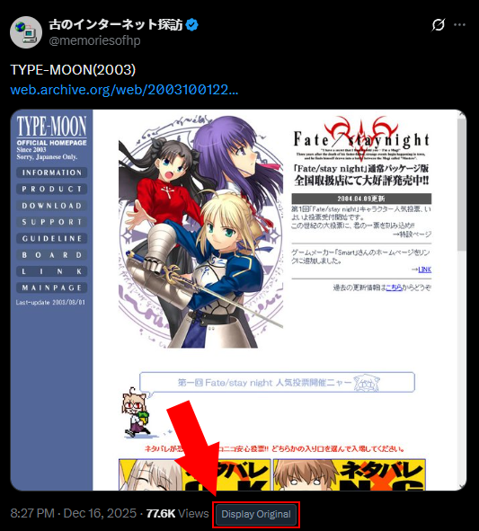
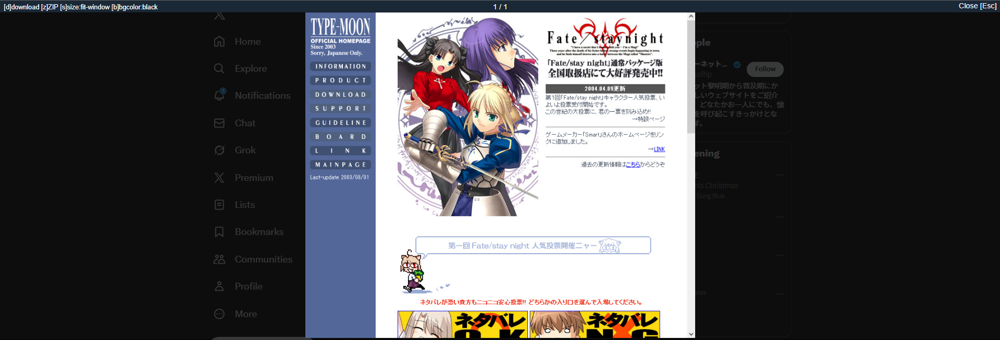
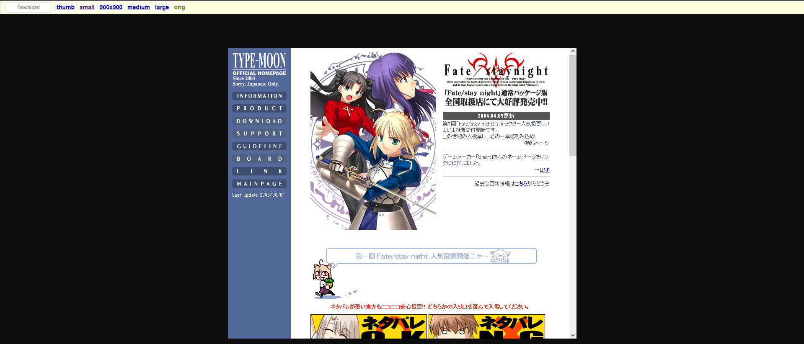

  <ul style="list-style: none;">
    

      <h1>X-View-Original-Images</h1>
      
Continuational fork of furyutei's "Twitter View Original Images" extension.

      

    

  </ul>

X View Original Images is an extension that allows you to open & download the original source image of a given X post. There is also a script to assist with image downloads (converting downloaded extensions from '~.jpg-orig' to '~-orig.jpg', etc.).
<h1>Installation Guide</h1>
<h3>Chrome Webstore</h3>
In the environment of Google Chrome, Vivaldi, Opera, or any Chromium-based browser, you can download the extension from the official webpage here.
<h3>Google Chrome / Chromium Unpack</h3>
<ol>
  <li>Download the Github repository.
  <ol>
      <li>In your Downloads folder, unzip the local copy of the Github repository.</li>
  </ol>
  </li>
  <li>Open up the Extensions page (Extensions -> Manage Extensions).
  <ol>
      <li>Alternatively, you can type "chrome://extensions/" into the url bar above.</li>
  </ol>
  </li>
  <li>On the top right corner, enable "Developer Mode".</li>
  <li>Once "Developer Mode" is enabled, there should be a button called "Load unpack". Click on that button.</li>
  <li>Make your way to the "src" folder of the unzipped local copy of the Github repository.</li>
  <li>Once it's open, click on "Select Folder" on the bottom right corner.
  <ol>
      <li>Depending on your operating system, this may be different. But regardless, it should act the same way.</li>
  </ol>
  </li>
  <li>The extension should be functional afterwards!</li>
</ol>
<h1>Basic User Guide</h1>
The extension is fairly easy to understand on a basic level. Whenever you're browsing your timeline, a button will appear under the image called "Display Original".

  

Clicking on the button (or clicking the image itself) will display all available images. In the example below, you can also see text on the top left corner that corresponds with keybinds. These keybinds include:
 
<ul>
  <li>Download (downloads the image(s) individually)</li>
  <li>Zip Download (downloads the image(s) under a .zip file)</li>
  <li>Image Size (sets the size of the display image)</li>
  <li>Background Color (sets the color of the background during viewing)</li>
</ul>

  

You can also right click an image to show the raw image itself. In this display, it will show a completely different window with various options to use. These options include:
 
<ul>
  <li>Download (self explanatory)</li>
  <li>thumb (thumbnail size)</li>
  <li>small</li>
  <li>900x900</li>
  <li>medium</li>
  <li>large</li>
  <li>orig (original)</li>
</ul>

  

<h3>Languages / Translations</h3>
Currently, the plugin only supports English, Japanese, and Korean.
<h1>Limitations</h1>
Due to this being a near direct reupload of furyutei's original extension, this extension does not support the downloading of videos, GIFs, or user icons. This will change in the future if I have enough time to spare. For now, please do not expect this to come anytime soon.
  
It is recommended that you use <a href='cobalt.tools'>cobalt.tools</a> to download videos or GIFs of posts.
<h1>Credits</h1>
<ul>
  <li><a href="http://furyu.hatenablog.com/">furyutei</a> - Original Extension Author</li>
  <li><a href="https://github.com/hogashi/twitterOpenOriginalImage">twitterOpenOriginalImage</a> - Extension that inspired furyutei's</li>
  <li><a href="http://pulsekinesis.com/">pulsekinesis</a> - Repository Hoster</li>
</ul>
